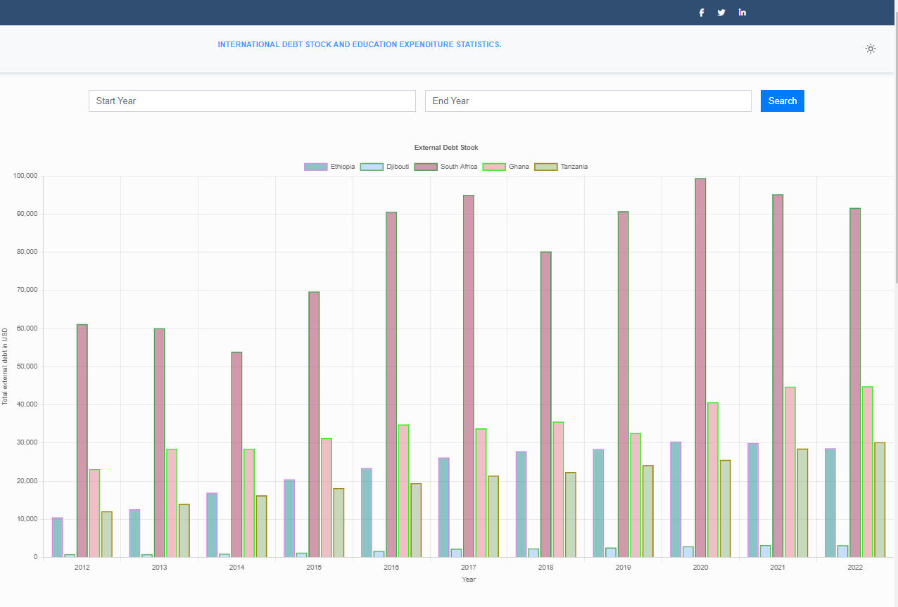
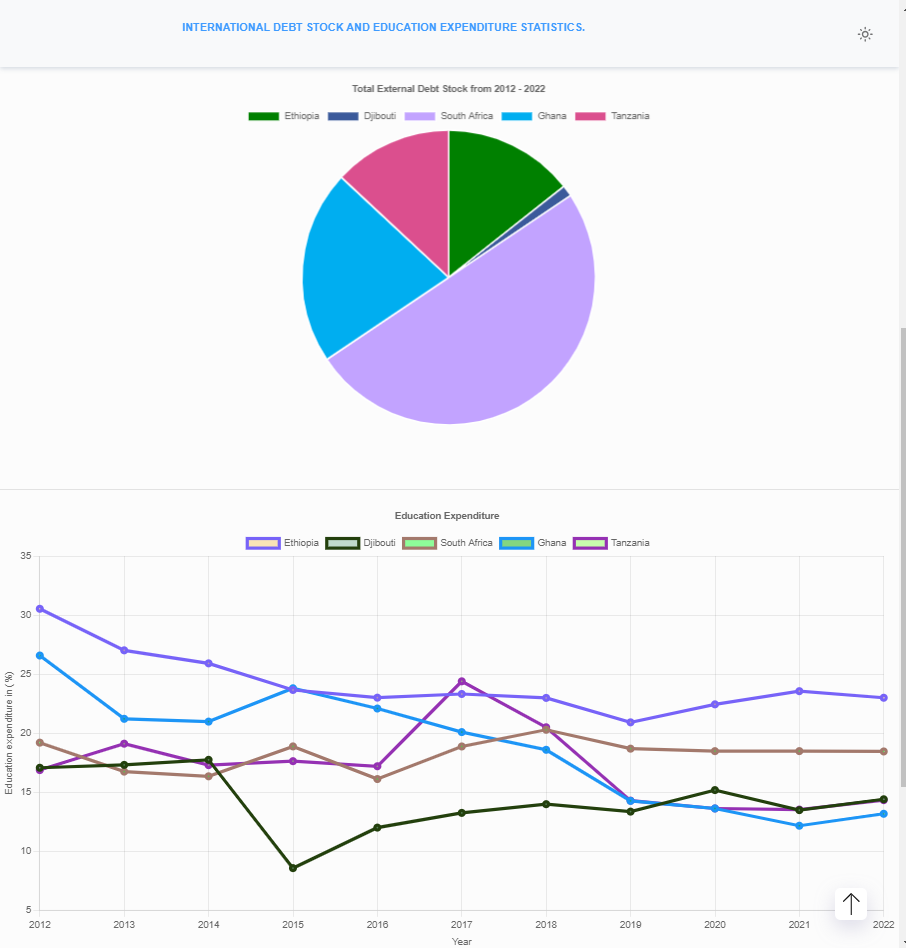

 ## Live demo 

Frontend: https://fkadu.netlify.app/

Bacend: https://back-end-6t80.onrender.com

## Project clone from github repository

git clone https://github.com/SE-fka/DebtStock

## ABOUT THE FRONTEND PROJECT 

React Js version 18

cd Frontend

npm install

npm start

## ABOUT THE BACKEND PROJECT

Node Js version 20

cd Backend

npm install

npm start

## Data collection 

1. External debt data: https://datatopics.worldbank.org/debt/ids/countryanalytical/eth/counterpartarea/wld.

2. Education expenditure data: https://data.worldbank.org/indicator/SE.XPD.TOTL.GB.ZS

 ## sample Image

 
 
 